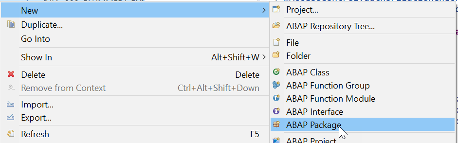

# Title Title from the Tutorial body
<!-- description --> Description from the Tutorial body

## Prerequisites  
 - **Proficiency:** Beginner
 - **Web IDE** If you do not have the Web IDE open, follow these steps: [Enable and open the HANA Cloud Platform Web IDE](https://developers.sap.com/trials-downloads.html)
 - **Tutorials:** This tutorial is part of a series. The previous tutorial is [Set up the Northwind Destination](https://developers.sap.com/trials-downloads.html)


## You will learn  
Now that you have set up in the HANA Cloud Platform (HCP) cockpit, you will connect that destination to your local application.  

## Intro

Virtual tables point to data stored in another database.  Federated queries join local and virtual tables.  


### Create package

1. Create a new package for this tutorial, by choosing **New > ABAP Package**.

    <!-- border --> 

2. Enter a name **`Package Z_ENHANCE_CDS_XXX`** and description **Enhance CDS Tutorial 2020**, then follow the wizard.

    <!-- border; size:250px --> 

    <!-- border --> 


### Extra match rule

### single-choice

### multi-choice

### Last step

Virtual tables point to data stored in another database.  Federated queries join local and virtual tables.


[Click to download mp3](Jinglebellsringtone.mp3)

[Click to download s q l](JOINS.sql)

[Click to download doc](1n.doc)

[Click to download x m l](template.xml)

[Click to download docx](2n.docx)

[Click to download t x t](3n.txt)

[Click to download p n g](access40.png)

[Click to download mp4](4n.mp4)

[FILE WITH MORE THAN 1 MB mp3](ChristmasForKidsJingleBells.mp3)

```CDS
    @UI           : {
    lineItem      : [{position: 10, importance: #HIGH}]
    }
    @UI           : {
    lineItem      : [{position: 10, importance: #HIGH}]
    }
    key TravelID;

    @UI           : {
          lineItem      : [{position: 15, importance: #HIGH}]
          }
    AgencyID,

    @UI           : {
          lineItem      : [{position: 20, importance: #HIGH}]
          }
    CustomerID,

    @UI           : {
          lineItem      : [{position: 30, importance: #HIGH}]
          }
    BeginDate,

    @UI           : {
          lineItem      : [{position: 40, importance: #HIGH}]
          }
    EndDate,

    BookingFee,

    @UI           : {
          lineItem      : [{position: 50, importance: #HIGH}]
          }
    TotalPrice,

    ```


---
